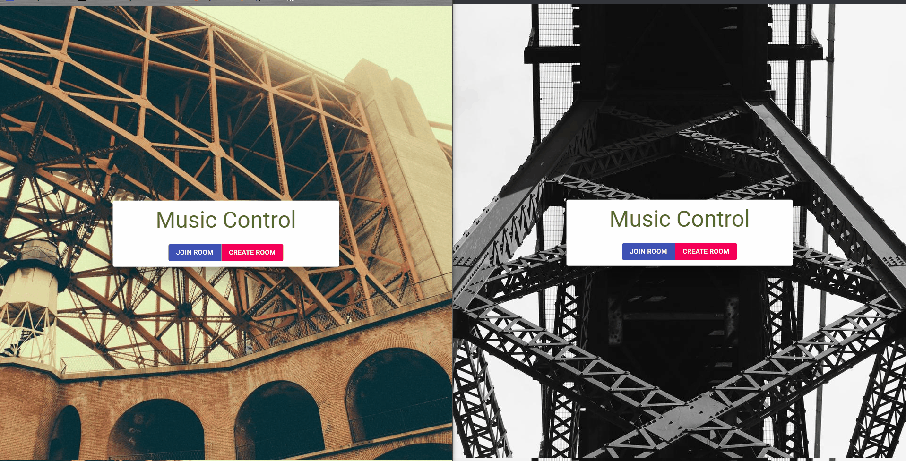
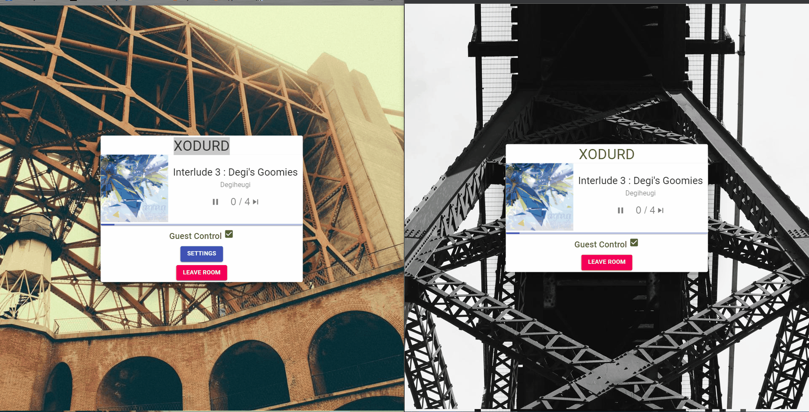
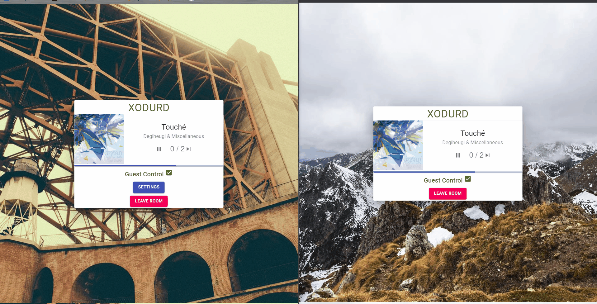

# Django + React

## Introduction

This is a project for music control. You can create and join room, and get votes > requrie to skip the current annoying song you don't like.

**Django + React + Spotify API**

## Demo Gif
 1. Create & join room

 
 2. Song info & control

 

 3. vote to skip

## Practice Diary

- Day 1 : Set up project; intergration of Django & React
- Day 2 : Using material UI; Post request; create room detail(handle url params in react)
- Day 3 : Room join page; room detail; router in pages with navigate;
- Day 4 : Updpate Room info ; Connect Spotify web API;
- Day 5 : Get current song info; pause/play; vote to skip

- Partily changed to function based structure.

## Future

- Refactor all to functional componments
- Deploy to the heroku

### By Gengcong Yan, 2022
- Great help from the tutorial channel - [Tech With Tim ](https://www.youtube.com/c/TechWithTim)
